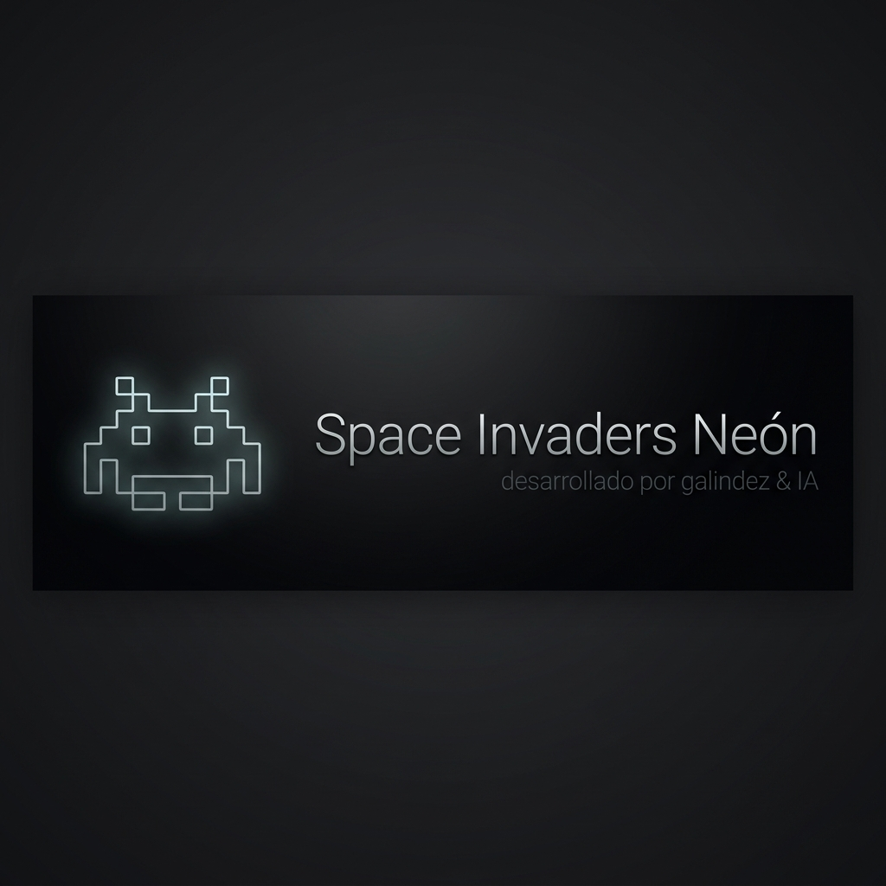

<div align="center">
  
  
  # 👾 Space Invaders Neón
  
  **Un tributo cyberpunk moderno al clásico juego Space Invaders.**
  
  [**🎮 JUEGA AHORA EN VIVO**](https://juegospaceinvaders-948774944187.europe-west1.run.app/)

</div>

---

## 🌟 Descripción

**Space Invaders Neón** revoluciona el clásico juego de naves combinando un diseño **cyberpunk** y *glassmorphism* con mecánicas emocionantes. El juego presenta controles responsivos tanto para teclado en computadora como mediante botones táctiles para dispositivos móviles, junto a un ambiente sonoro retro-futurista.

El proyecto está diseñado usando el `<canvas>` nativo de HTML5 para un renderizado brillante, simulando las luces de neón con técnicas avanzadas.

## 🚀 Arquitectura del Proyecto

El sistema está construido bajo los siguientes pilares tecnológicos y arquitectónicos:

- **Framework y UI**: 
  - Desarrollado como una *Single Page Application (SPA)*.
  - Basado en **React 19** y empaquetado con **Vite** para una carga inicial ultrarrápida.
  - Tipado de datos estricto usando **TypeScript**.
  - Estilizado utilizando **Tailwind CSS V4** (configuración de neones personalizados vía utilidades arbitrarias).
  
- **Motor Gráfico y Logica**:
  - Un bucle de renderizado optimizado con la API Canvas en 2D que maneja el movimiento de las naves, los disparos y el sistema de partículas/colisiones de manera fluida.
  
- **Infraestructura y Despliegue Automático (CI/CD)**:
  - Encontrándose desplegado en Google Cloud Run a través de **Google Cloud Build** (`cloudbuild.yaml`).
  - Utiliza un `Dockerfile` en configuración multietapa compilando de forma segura y sirviendo a través de un servidor adaptado para el puerto `8080`.

## 🕹️ Cómo Jugar

1. **Escritorio**: Utiliza las **Flechas del Teclado** (`Izquierda`/`Derecha`) o las teclas **A y D** para mover tu nave. Usa la **Barra Espaciadora** para disparar.
2. **Móviles**: Utiliza los botones táctiles en pantalla para desplazarte a los lados y disparar a los alienígenas.
3. ¡Destruye todas las naves alienígenas antes de que lleguen a la parte inferior de la pantalla o destruyan tus escudos!

## ⚙️ Correr en Local (Desarrollo)

Siga estas instrucciones para preparar, instalar y probar el entorno a nivel local de forma rápida:

**Requisitos Previos:** Asegúrate de tener instalado en tu computadora **Node.js** (versión 18+ recomendada) y Git.

1. **Clonar e Ingresar al repositorio**:
   ```bash
   git clone https://github.com/tu-usuario/JuegoSpaceInvaders-.git
   cd JuegoSpaceInvaders-
   ```

2. **Instalar Dependencias**:
   ```bash
   npm install
   ```

3. **Ejecutar el Servidor de Desarrollo**:
   ```bash
   npm run dev
   ```

4. **Visualizar el Proyecto**:
   Abre la URL proporcionada en tu terminal (usualmente `http://localhost:5173`).

## 📜 Licencia y Créditos

Proyecto desarrollado por **Galindez & IA**.
